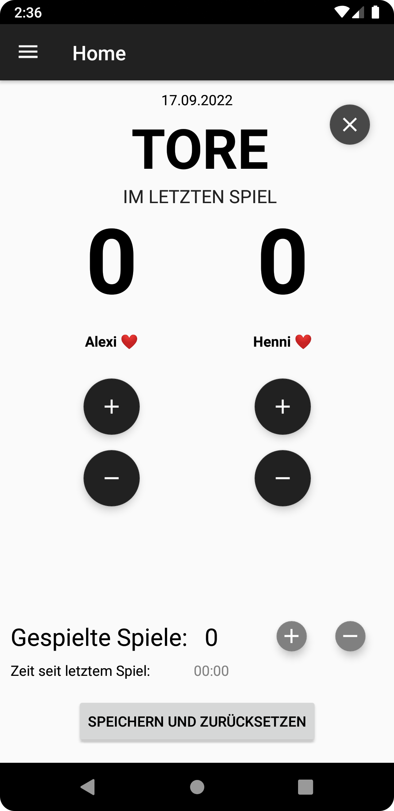
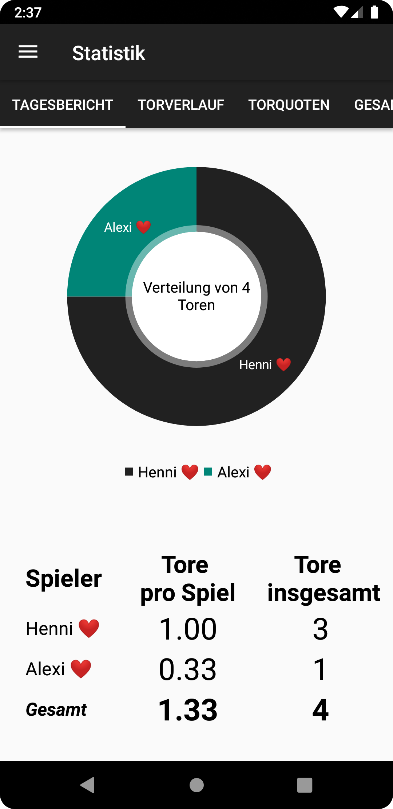
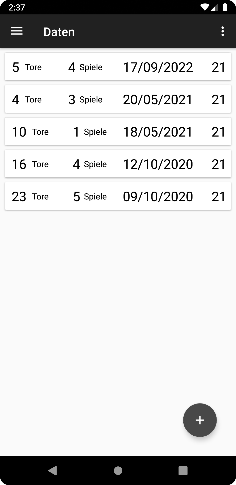
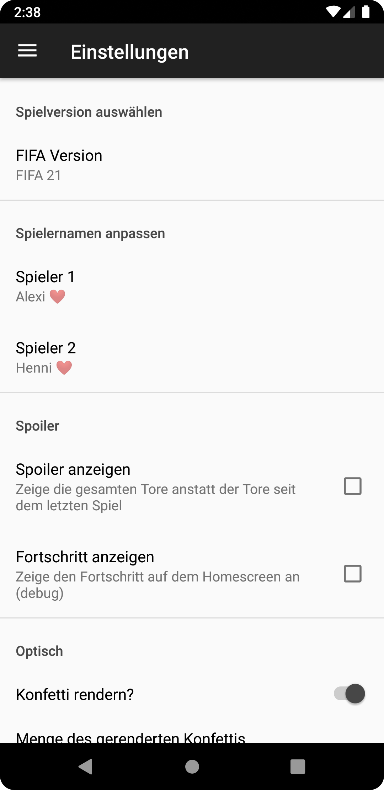

# FIFAGoalCount  
This app can be used to keep track of the individual performance when playing FIFA in “couch-coop” mode together, either when playing against other players or the AI.

## History  
This little app was created to learn the basis of Android development with Kotlin. 
It all started with a primitive counter to analyze who performed better on a game day. 
To keep track of the performance over several game days, an option to save the data in an SQLite database was implemented. 
Additionally, to make things a little bit fancier, 
the libraries [MPAndroidChart](https://github.com/PhilJay/MPAndroidChart) and 
[Konfetti](https://github.com/DanielMartinus/Konfetti) were added.
MPAndroidChart is used to display statistics in a clean and intuitive way.
Konfetti adds a nice and satisfying animation every time a goal is scored.

## The App  
The app itself has four different screens:

### Homescreen:  

Statistics:  

Data overview:   

Settings:  

  

